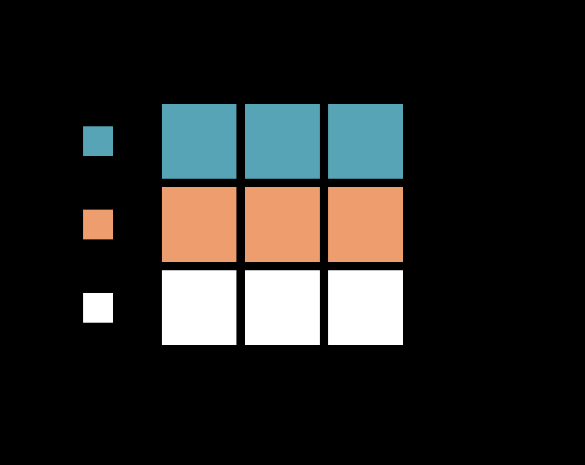

[](https://classroom.github.com/a/2Ckaj58x)



# Puzzle Game

This game is inspired by the Rubik's cube.

### Controls:

T - Hide/show timer

#### Keys used for controlling the cube:

```
Q W E
A S D
Z X C
```

Press and hold one of these key to select what row or column you want to move: 

`W` - Up
`X` - Down
`A` - Left
`D` - Right
`S` - Center

Then by selecting a key near the key you are holding down, the cubes move in the direction of the newly pressed key. 

For example, if you press and hold `X` and then press `C`, you move the bottom row to the right on step.